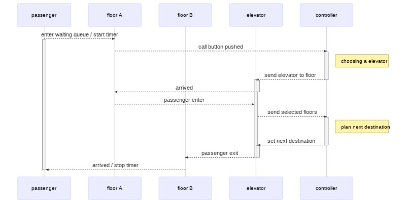

# Simulation

This program simulates the operation of an elevator system. The simulation is used to investigate the scheduling algorithm based on different traffic scenarios. There is also a terminal GUI to follow the current progress.

## Architecture


The simulation is modelled as microservices that are deployed for each components:

- controller: schedules the destination of the elevators
- elevator: "workers" that processes the queue at each floor
- floor: maintains a queue of waiting passengers

### Message Flow

Below is the flow of messsages sent between the services for sending a passenger to their destination floor.



## Scenario Definition Format

I have defined a definition in YAML format to describe passengers arriving at a floor at a certain interval and their destinations.

The following scenario definition describes two scenarios:

1. 20 passengers arriving at floor 0 and wants to go to floor 0 at time 0
2. 10 passengers arriving at floor 1 and wants to go to floor 2 at time 5

```yaml
- time: 0
  passengers:
    - start: 0
      destinations:
        1: 20
- time: 5
  passengers:
    - start: 1
      destinations:
        2: 10
```

## Running the Simulation

- Builds the image and run in background: `docker-compose up --build --remove-orphans -d`
- Start gui: `cd gui; python3 dashboard.py`
- Send input to floors: `cd input-feeder; python3 input_feeder.py -samples samples/one_at_a_time.yaml`

Example simulation running with GUI:

[](https://asciinema.org/a/310760)
